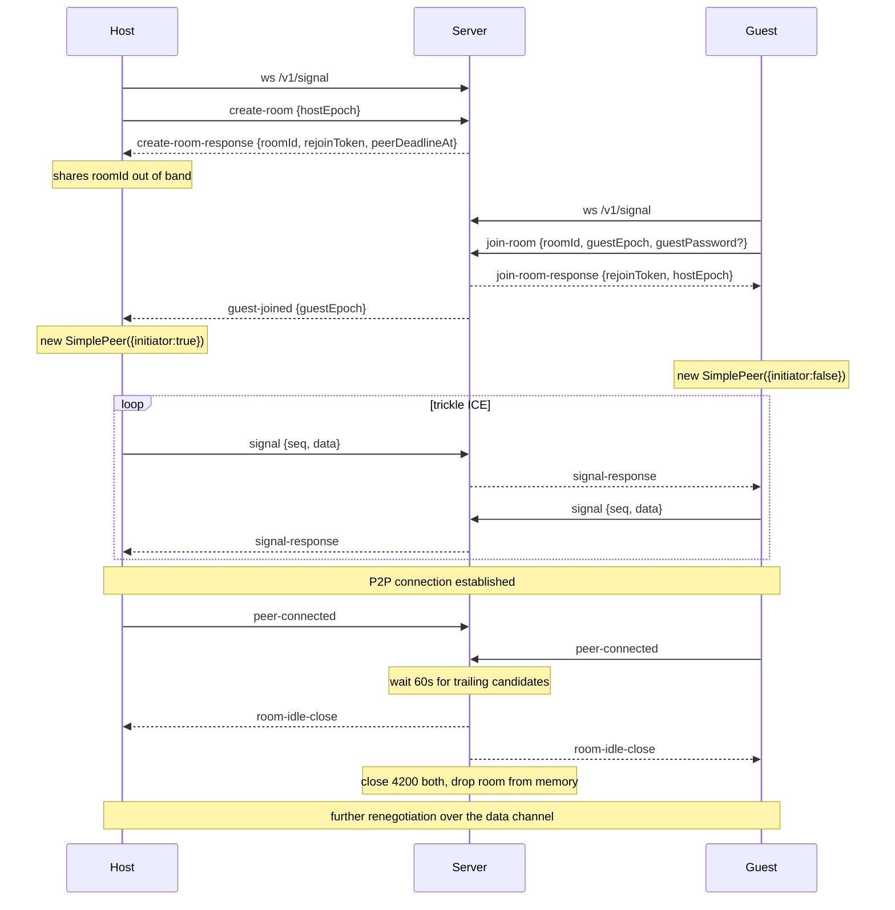
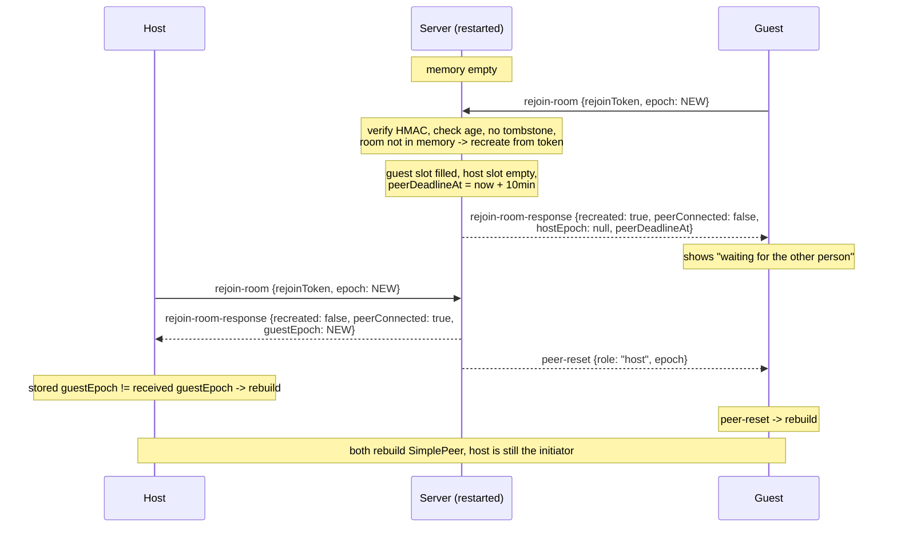

# simple-peer Signaling Server

A minimal signaling server for the
[simple-peer](https://github.com/feross/simple-peer) WebRTC client library.

Its only job is to shuttle WebRTC signaling data between exactly two browsers
until they establish a direct peer-to-peer connection, then get out of the way.

## Design principles

1. **One instance.** The server is deployed as a single process. There is no
   sharding, no consistent hashing, no inter-server communication.
2. **No external dependencies.** No database, no Redis, no message queue. All
   state lives in memory in the server process.
3. **State loss is a normal event, not an error.** A crash, a redeploy, or a
   deliberate memory eviction can destroy all room state at any time. Recovery
   is handled by signed rejoin tokens (see [Rejoin tokens](#rejoin-tokens)),
   which let either client rebuild a room the server has forgotten.
4. **Stop paying for idle connections.** Once two peers are directly connected,
   the server closes their WebSockets and drops the room from memory. See
   [Releasing sockets after peer connection](#releasing-sockets-after-peer-connection).

### Non-goals

- Persistence of any kind across process restarts.
- Rooms with more than two participants.
- Relaying media or application data. Only signaling passes through here.
- TURN/STUN. Configure those separately in the simple-peer client.

## Terminology

- **Room** — a pairing of exactly two clients, identified by a server-assigned
  `roomId`. A room has two **slots**: `host` and `guest`.
- **Host** — the client that called `create-room`. The host is always the
  simple-peer **initiator**.
- **Guest** — the client that called `join-room`. Never the initiator.
- **Epoch** — a random string a client generates each time it constructs a new
  `SimplePeer` instance. It tells the server whether a reconnecting client is
  continuing its existing WebRTC session or has started a fresh one. See
  [Epochs and signal buffering](#epochs-and-signal-buffering).
- **Slot occupancy** — a slot is *occupied* when a live WebSocket is attached to
  it. A room can exist with zero, one, or two occupied slots.

To create multiple peer connections, a client creates one room per pair.

## Identifier encoding

All server- and client-generated identifiers in this protocol (except `roomId`) —
use base64 URL encoding.

### roomId

`roomId` is an **opaque arbitrary string** as far as the protocol is concerned.
The server's only hard requirements are:

1) it is **unique among live rooms and live tombstones on this instance**.
2) it only uses [0-9a-z_-] characters

**Collision-checked on generation.** Regenerate on the event of a collision with
a live room or tombstone rather than assuming uniqueness.

#### Generated format

Room IDs minted by this server have a human-friendly, speakable form (see
`internal/roomid`):

```
[shard]-[adjective]-[noun]-[sequence]
```

e.g. `us-golden-dragon-k3`. All parts are lowercase.

- **shard** — an opaque tag assigned to the backend instance, drawn from
  `[0-9a-z]`. For now every instance uses `us`. A future load balancer can
  route on this prefix. The code must not assume anything beyond `[0-9a-z]`.
- **adjective**, **noun** — drawn from curated, Chinese-culture-themed word
  lists containing only `[a-z]` characters, with no negative or vulgar
  connotations (copied from the `mahjong-p2p` `names` package).
- **sequence** — a 2-digit base-36 (`0-9a-z`) suffix that widens the ID space
  and absorbs collisions. It is capped at 2 digits to avoid randomly spelling
  out a bad word.

The whole ID uses only `[0-9a-z-]`, a subset of the protocol's allowed
`[0-9a-z_-]`. The entropy is far below 128 bits (≈ 50 adjectives × 100 nouns ×
1296 sequences ≈ 6.5M possibilities); uniqueness is provided by the
collision-checked generation with up to 5 retries, **not** by entropy. This is
an explicit trade-off of readability over unguessability: the `roomId` is not a
secret — the signed `rejoinToken` (256-bit MAC) is the bearer credential that
authorizes rejoining a room.

On input, the server caps `roomId` at **64 characters** before doing any map
lookup or allocation. An unknown ID is simply `ROOM_NOT_FOUND`.

## How this maps onto simple-peer

The implementer should keep this mapping in mind; the protocol is shaped around
it.

| simple-peer | Signaling server |
|---|---|
| `new SimplePeer({ initiator: true })` | Host, after `create-room-response` **and** `guest-joined` |
| `new SimplePeer({ initiator: false })` | Guest, after `join-room-response` |
| `peer.on('signal', d => ...)` | Send `{ type: "signal", data: JSON.stringify(d) }` |
| Received `signal-response` | `peer.signal(JSON.parse(msg.data))` |
| `peer.on('connect')` | Send `{ type: "peer-connected" }` |
| `peer.on('close')` / `peer.on('error')` | Reconnect via `rejoin-room` with a new epoch |

Two properties of simple-peer this design relies on:

- A data channel is **always** created, even for media-only calls, so the
  `connect` event always fires and is a reliable "we no longer need the server"
  signal.
- Renegotiation (adding/removing tracks) emits further `signal` events. After
  the server has released the sockets, clients must carry those over the
  established data channel via `peer.send()` rather than through this server.
  See [Renegotiation after socket release](#renegotiation-after-socket-release).

## Transport

All communication happens over a single WebSocket carrying JSON text frames.

```
GET /v1/signal
Upgrade: websocket
```

The `roomId` is **not** in the URL path. It is assigned by the server in
`create-room-response` and supplied by the guest in the `join-room` message
body.

Framing rules:

- Text frames only. A binary frame is a protocol error (close `4001`).
- Each frame must contain exactly one JSON object.
- Maximum frame size is **64 KB** (`maxFrameBytes`). This must be enforced by
  the WebSocket library at the frame level so oversized frames are rejected
  without being buffered into memory. A typical SDP offer is 4–8 KB, so this is
  already generous.
- The server sends a WebSocket ping every 30 s (`pingIntervalSec`) and closes
  the connection if two consecutive pongs are missed. This is the primary
  mechanism for detecting half-open TCP connections.

### Handshake timeout

After the upgrade completes, the client must send exactly one of `create-room`,
`join-room`, or `rejoin-room` within **10 s** (`handshakeTimeoutMs`). Otherwise
the server closes the connection with `4001` / `HANDSHAKE_TIMEOUT`. A connection
that has not been attached to a room slot holds no room state and must not be
allowed to linger.

Sending a second handshake message on an already-attached connection is
`UNEXPECTED_STATE`.

## Message envelope

Every client→server message:

```typescript
{
  type: string;
  requestId?: string;  // opaque; echoed back on the matching response
  // ...type-specific fields
}
```

Every server→client message:

```typescript
{
  type: string;
  requestId?: string;  // present only on direct responses to a request
  // ...type-specific fields
}
```

Server-initiated events (`guest-joined`, `peer-disconnected`, …) carry no
`requestId`.

Timestamps are ISO 8601 strings in UTC. Because client clocks are frequently
wrong, every absolute deadline the server sends is accompanied by a relative
`*InSeconds` value; clients should prefer the relative value.

### Epoch naming rule

`hostEpoch` and `guestEpoch` mean exactly what they say, in every message,
regardless of who is reading. There is no perspective-relative epoch field
anywhere in the protocol — no "my epoch" or "peer epoch", because those invert
meaning depending on which side deserializes them.

Two consequences:

- Messages that report room state carry `hostEpoch` and `guestEpoch` **both**,
  so a client never has to work out which one is its own. It compares the one
  that isn't its role.
- A bare `epoch` field appears only in messages that already name a `role`, and
  means that role's epoch.

(The `peer-connected` / `peer-disconnected` / `peer-rejoined` / `peer-reset`
event *names* still say "peer". That refers to the other client and to the
WebRTC peer connection, not to an epoch, and is unambiguous.)

## Connection state machine

```
                      ┌─────────────┐
   ws upgrade ───────▶│ UNATTACHED  │──── 10s timeout ──▶ close 4001
                      └──────┬──────┘
                             │ create-room / join-room / rejoin-room
                             ▼
                      ┌─────────────┐
                      │  ATTACHED   │◀── signal / peer-connected / close-room
                      └──────┬──────┘
                             │ socket closes, or evicted by a newer rejoin,
                             │ or released after peer-connected
                             ▼
                          (closed)
```

A connection is only ever attached to one slot of one room, and a slot only ever
holds one connection. Attaching to an occupied slot **evicts** the previous
connection (close `4400`) — see [RejoinRoom](#rejoinroom).

## Client → server messages

### CreateRoom

Creates a new room and takes the host slot.

```typescript
{
  type: "create-room";
  requestId?: string;
  hostEpoch: string;                  // 128 bits, base64url
  guestPassword?: string;             // omit for no password
  cloudflareTurnstileToken?: string;  // required if the server has Turnstile enabled
}
```

Success:

```typescript
{
  type: "create-room-response";
  requestId?: string;
  roomId: string;                 // server-assigned, opaque
  role: "host";
  rejoinToken: string;
  peerDeadlineAt: string;         // ISO; room closes if the guest hasn't joined by then
  peerDeadlineInSeconds: number;  // default 600
  roomExpiresAt: string;          // ISO; in-memory lifetime of this room instance
  roomExpiresInSeconds: number;   // default 5400
  rejoinTokenExpiresAt: string;   // ISO; after this, the pairing cannot be rebuilt
}
```

Server assignment of `roomId` (rather than client-supplied IDs) removes room
squatting entirely: no client can occupy or pre-register an ID it was not given.

The host should display `peerDeadlineInSeconds` to the user and must **not**
construct its `SimplePeer` yet. It waits for `guest-joined`.

### JoinRoom

Takes the guest slot of an existing room.

```typescript
{
  type: "join-room";
  requestId?: string;
  roomId: string;
  guestEpoch: string;
  guestPassword?: string;  // required iff the room was created with one
}
```

Success:

```typescript
{
  type: "join-room-response";
  requestId?: string;
  roomId: string;
  role: "guest";
  rejoinToken: string;
  hostConnected: boolean;      // is the host's socket attached right now
  hostEpoch: string | null;    // null if the host slot has never been occupied
  guestEpoch: string;          // echo of what the server recorded
  roomExpiresAt: string;
  roomExpiresInSeconds: number;
  rejoinTokenExpiresAt: string;
}
```

The host simultaneously receives:

```typescript
{ type: "guest-joined"; guestEpoch: string; }
```

Rules:

- If the guest slot is already occupied by a live connection → `ROOM_FULL`.
  A third party cannot displace an active guest; only a valid `rejoinToken` can.
- Joining clears the room's peer deadline. Only `roomExpiresAt` applies
  afterwards.
- A guest cannot learn a `roomId` before the room exists, since the ID is minted
  by `create-room`. So `ROOM_NOT_FOUND` on a join means the room is genuinely
  gone — expired, closed, or lost with the server's memory. The one recoverable
  case is a server restart between create and join: the host will rejoin and
  recreate the room within a second or two, so a guest should retry a first join
  with backoff for up to 30 s before surfacing an error. A guest that has never
  joined holds no token and therefore cannot recreate the room itself.

### RejoinRoom

The recovery path. Reattaches to a slot using a signed token — and if the server
has lost the room, **rebuilds it from the token**.

```typescript
{
  type: "rejoin-room";
  requestId?: string;
  rejoinToken: string;
  epoch: string;       // the epoch for the slot named in your token
}
```

`roomId` and `role` are carried inside the token and must not be sent
separately; the token is the sole authority on both. The server records `epoch`
as `hostEpoch` or `guestEpoch` according to the token's `role`.

Success:

```typescript
{
  type: "rejoin-room-response";
  requestId?: string;
  roomId: string;
  role: "host" | "guest";
  recreated: boolean;         // true = server had no state; room rebuilt from token
  peerConnected: boolean;     // is the other slot occupied right now
  hostEpoch: string | null;
  guestEpoch: string | null;
  peerDeadlineAt: string | null;      // set when the other slot is empty
  peerDeadlineInSeconds: number | null;
  roomExpiresAt: string;
  roomExpiresInSeconds: number;
  rejoinTokenExpiresAt: string;
}
```

If `recreated` is `true`, the peer's WebRTC session is definitively gone. The
client must destroy its `SimplePeer`, construct a new one with a **new epoch**,
and wait (host) or begin signaling (guest) as if starting fresh.

Server-side validation order — implement exactly this sequence:

1. Parse and verify the token (see [Rejoin tokens](#rejoin-tokens)). Invalid
   signature or malformed → `INVALID_REJOIN_TOKEN`.
2. `now > createdAt + rejoinTokenTtl` → `ROOM_EXPIRED`.
3. `roomId` present in the tombstone LRU → `ROOM_CLOSED`.
4. Look up the room in memory:
   - **Found** → attach to `token.role`. If that slot already holds a
     connection, close the old one with `4400` and take the slot. This is
     required: a half-open TCP connection must never permanently lock a client
     out of its own room.
   - **Not found** → recreate the room (see
     [Recreating a lost room](#recreating-a-lost-room)) and attach to
     `token.role`. Respond with `recreated: true`.
5. Replay buffered signals if the slot's epoch is unchanged.

### Signal

```typescript
{
  type: "signal";
  requestId?: string;
  seq: number;    // starts at 1, increments per message, per (slot, epoch)
  data: string;   // JSON.stringify of the object simple-peer emitted
}
```

Delivered to the other slot as:

```typescript
{
  type: "signal-response";
  fromRole: "host" | "guest";
  fromEpoch: string;
  seq: number;
  data: string;
  receivedAt: string;  // server-generated ISO timestamp
}
```

`seq` replaces a client-supplied timestamp. It exists so the server can drop
duplicates on replay (`seq <= lastSeq` for the current epoch is silently
ignored) and so ordering is preserved without trusting client clocks. The server
never inspects `data`; it is opaque.

If the receiving slot is unoccupied, the message is buffered — see below.

### PeerConnected

```typescript
{ type: "peer-connected"; }
```

Sent by a client when its `SimplePeer` emits `connect`. No response. Idempotent.
When **both** slots have reported this, the server begins releasing the room —
see [Releasing sockets after peer connection](#releasing-sockets-after-peer-connection).

### CloseRoom

```typescript
{ type: "close-room"; }
```

Ends the pairing permanently. The server writes a tombstone, sends
`{ type: "room-closed", reason: "closed-by-peer" }` to the other slot, and
closes both sockets with `4013`. After this, rejoin tokens for the room are
refused with `ROOM_CLOSED` even if they have not expired.

Clients should send this when the user deliberately ends the session. It is what
makes tombstones meaningful and lets the other side show "the call ended" rather
than hanging.

## Server → client events

| Type | Payload | Meaning |
|---|---|---|
| `guest-joined` | `{ guestEpoch }` | Host may now construct `SimplePeer({ initiator: true })` |
| `peer-disconnected` | `{ role }` | Other side's socket dropped. Stop expecting signals; do not destroy the `SimplePeer` (an established P2P connection survives this) |
| `peer-rejoined` | `{ role, epoch }` | Other side is back with the **same** epoch. Its WebRTC session continued |
| `peer-reset` | `{ role, epoch }` | Other side is back with a **new** epoch. Destroy your `SimplePeer`, build a new one, roles unchanged |
| `room-idle-close` | `{ reason: "peer-connected" }` | Both peers are connected; sockets are being released. Followed by close `4200`. **Not an error** |
| `room-closed` | `{ reason }` | Room terminated. Followed by close `4013` |
| `room-expired` | — | In-memory lifetime or peer deadline reached. Followed by close `4014`. Rejoin is still permitted while the token is valid |
| `server-shutdown` | `{ reconnectAfterMs }` | Graceful drain. Followed by close `4300` |
| `error-response` | see below | Request failed |

## Epochs and signal buffering

WebRTC signaling is a **stream**, not a single value. With trickle ICE, every
candidate matters; dropping any of them costs connectivity. So when a slot is
unoccupied, the server buffers **every** signal for it, in order.

Buffer limits per slot: **64 messages** (`maxBufferedSignals`) or **256 KB**
(`maxBufferedSignalBytes`), whichever comes first. On overflow the server sends
`SIGNAL_BUFFER_OVERFLOW` to the *sender*, clears the buffer, and marks the
receiving slot as needing a reset.

Whether replaying that buffer is correct depends on what happened to the peer,
which is what the epoch answers:

- **The WebSocket dropped but the page lived.** The client's
  `RTCPeerConnection` is still valid. It reconnects with the **same** epoch. The
  server replays the buffer in order and sends `peer-rejoined` to the other slot.
- **The page reloaded, or the client destroyed and rebuilt its peer.** It
  reconnects with a **new** epoch. The buffered signals belong to a dead session
  and replaying them would corrupt the new one. The server **discards** the
  buffer and sends `peer-reset` to the other slot, which must then destroy and
  rebuild its own `SimplePeer`. Roles do not change: the host remains the
  initiator.

Clients persist `{ roomId, role, rejoinToken, hostEpoch, guestEpoch }` in
`sessionStorage`. Because both epochs are stored under their canonical names,
a client compares the stored value against whatever the server reports for the
same name — no perspective translation is involved.

### Epoch information is symmetric

Whenever a client attaches to a slot, **both** sides end up knowing the current
state:

- The arriving client receives both `hostEpoch` and `guestEpoch` in its
  `join-room-response` / `rejoin-room-response` (`null` for a slot that has
  never been occupied in this room instance).
- The other slot is told the arriving epoch via `peer-rejoined` or `peer-reset`.

The server chooses between those two events by comparing the arriving epoch to
the epoch it currently has recorded for that slot. A recreated room has no
recorded epochs, so the *first* client to attach triggers no event (there is
nobody to notify) and the *second* one triggers `peer-reset`, since an unknown
prior epoch must be treated as changed.

The arriving client applies the same rule in reverse: if the epoch it receives
for the *other* role differs from what it had stored under that name, it
destroys and rebuilds its `SimplePeer`. This symmetry is what makes recovery from
a full server restart work — both sides independently conclude they must start
over, and neither waits for the other.

### Sequence numbers and epochs

`lastSeq` is tracked per slot **per epoch**. When a slot's epoch changes, the
server resets `lastSeq` to 0 along with clearing the buffer, and the client
restarts its own `seq` at 1 for the new `SimplePeer`. Without this reset, a fresh
peer's first signals would be silently swallowed as duplicates.

## Rejoin tokens

The rejoin token is a signed, self-describing credential. It is the only piece
of state that survives a server restart, and it is held by the client.

### Format

```
<version>.<base64url(payload)>.<base64url(signature)>

signature = HMAC-SHA256(serverSecret, "<version>.<base64url(payload)>")
```

`version` is the literal string `v1`. The payload is compact JSON:

```typescript
{
  v: 1;
  roomId: string;
  role: "host" | "guest";
  createdAt: number;              // unix seconds; when the ROOM was created, not the token
  guestPasswordHash?: string;     // base64(sha256(salt || password)); omitted if no password
  guestPasswordSalt?: string;     // base64(16 random bytes)
}
```

Both the host's and the guest's token carry the same `roomId`, `createdAt`, and
password fields; only `role` differs. The guest's token is issued on `join-room`
and reuses the room's original `createdAt`.

### serverSecret

`serverSecret` must be at least 32 random bytes, supplied via configuration.

**If it is not set, the server logs a fatal error and refuses to start.** A
generated-at-startup secret would silently invalidate every outstanding rejoin
token on each restart, which defeats the entire recovery mechanism — and it
would fail invisibly, only under exactly the conditions (a crash, a redeploy)
where recovery matters most. Failing loudly at boot is the only safe behavior.

Generate one with `openssl rand -base64 32`.

### Why it is signed

Signing lets `rejoin-room` be a **rejoin-or-recreate** operation. When the
server has no memory of a room, it can still prove the token is one it issued,
and therefore that this client legitimately held that slot. It then rebuilds the
room from the token's contents alone. A crash or redeploy costs the users a
reconnect, not a new invite link.

The payload is deliberately sufficient to reconstruct a room exactly: `roomId`
identifies it, `role` says which slot the bearer takes, `createdAt` bounds its
lifetime, and the password hash preserves the room's access control so a guest
that lost its own token can still `join-room` with the password.

The token is a bearer credential. It is unguessable (a 256-bit MAC over a
payload that includes the `roomId`) and scoped to one slot of one room, so
leaking it is no worse than leaking the room invite itself. The `roomId` itself
is human-friendly and not a secret (see §"roomId / Generated format").

### Verification

Signature comparison must be constant-time. Verify the signature **before**
parsing the payload's contents, and never act on payload fields from a token
that failed verification.

### Lifetimes

Three separate clocks, deliberately decoupled:

| Clock | Config | Default | What it bounds |
|---|---|---|---|
| Peer deadline | `peerDeadlineSec` | 600 (10 min) | How long a room waits with one slot empty |
| In-memory room lifetime | `roomMaxLifetimeSec` | 5400 (90 min) | How long one *instantiation* of a room may occupy memory |
| Rejoin token TTL | `rejoinTokenTtlSec` | 43200 (12 h) | How long the *pairing* can be rebuilt |

`roomExpiresAt = min(instantiatedAt + roomMaxLifetimeSec, createdAt + rejoinTokenTtlSec)`.

When a room hits `roomExpiresAt`, the server sends `room-expired`, closes both
sockets with `4014`, and frees the memory — but writes **no tombstone**. Clients
with valid tokens may immediately rejoin, which recreates the room with a fresh
in-memory lifetime.

> **Note on the 90-minute cap.** Coupling room lifetime to token lifetime (as an
> earlier draft did) would break calls longer than 90 minutes: a P2P connection
> that dropped at minute 100 could never be re-signaled. Decoupling them keeps
> the memory bound strict while letting long sessions recover. In practice the
> 90-minute cap now only reclaims rooms that never reached `peer-connected` —
> i.e. genuinely abandoned ones — because connected rooms are already released
> from memory. Raise `rejoinTokenTtlSec` if sessions are expected to run longer
> than 12 hours.

## Recreating a lost room

When `rejoin-room` presents a valid, unexpired, non-tombstoned token for a room
the server has no memory of, the server rebuilds it:

```
room.roomId            = token.roomId
room.createdAt         = token.createdAt          // preserved, bounds the token TTL
room.instantiatedAt    = now
room.expiresAt         = min(now + roomMaxLifetimeSec,
                             token.createdAt + rejoinTokenTtlSec)
room.guestPasswordHash = token.guestPasswordHash  // access control preserved
room.guestPasswordSalt = token.guestPasswordSalt
room.slots             = { host: empty, guest: empty }
```

then attaches the connection to `token.role` and sets a peer deadline of
`min(now + peerDeadlineSec, room.expiresAt)` for the still-empty slot.

### Either role can recreate

The operation is fully symmetric — **a guest rejoining first recreates the room
exactly as a host would.** Both tokens carry the same room-defining fields, so
the rebuilt room is identical regardless of who arrives first. Specifics worth
being explicit about:

- **Roles are fixed by the token.** A guest that recreates the room does *not*
  become the host and does *not* become the simple-peer initiator. When the host
  returns it takes the host slot and initiates as usual.
- **The peer deadline is role-agnostic.** This is why the field is
  `peerDeadlineAt` rather than the earlier `guestDeadlineAt`: on a guest-first
  recreate the room is waiting for the *host*. One field, one timer, both
  directions.
- **The waiting side is told what it's waiting for.** `rejoin-room-response`
  carries `peerConnected: false` and a non-null `peerDeadlineAt`, so a
  guest-first recreate can show "waiting for the other person to reconnect" with
  a countdown, identical to the host's create-room wait.
- **If the other side never returns**, the room hits `peerDeadlineAt`, the
  waiting client receives `room-expired` and close `4014`, and the pairing is
  over. The client should surface this as "the other person didn't come back"
  and offer to start a new room.
- **Recreates count against the same limits as creates**: the per-IP
  `create-room` token bucket, `maxRoomsPerIp`, and `maxRoomsGlobal`. Otherwise a
  single leaked guest token would be an unmetered room-allocation primitive.

The sequence in [Room lifecycle](#room-lifecycle) shows a guest-first recreate.

## Releasing sockets after peer connection

Once both peers are directly connected, the WebSocket is dead weight. Holding
tens of thousands of idle sockets is the dominant steady-state cost of a
signaling server, and it is avoidable.

When both slots have sent `peer-connected`, the server:

1. Waits `peerConnectedGraceSec` (default **60 s**) so any trailing ICE
   candidates still flow. Trickle ICE continues briefly after `connect` fires.
2. Sends `{ type: "room-idle-close", reason: "peer-connected" }` to both slots.
3. Closes both sockets with code `4200`.
4. Drops the room from memory. No tombstone.

Clients must treat close code `4200` as a **success** state, not a failure, and
must not enter their reconnect loop on it.

Recovery is entirely token-based: if the P2P connection later fails, both
clients observe it (`close` / `error` on their `SimplePeer`) and call
`rejoin-room`. Whichever arrives first recreates the room; the second rejoins
it. No wakeup channel or server-side coordination is needed, precisely because
both sides notice the failure independently.

This behavior is controlled by `releaseSocketsOnPeerConnected` (default `true`).
Set it to `false` to keep sockets open for the room's full lifetime, at
proportionally higher memory and file-descriptor cost.

### Renegotiation after socket release

Adding or removing a media track triggers renegotiation, and simple-peer emits
fresh `signal` events. After the sockets are released there is no server to
carry them — but the peers have a data channel, which simple-peer always
creates. Clients must send renegotiation signaling over that channel:

```js
// sending side
peer.on('signal', d => {
  if (peer.connected) peer.send(JSON.stringify({ kind: 'renegotiate', signal: d }))
  else ws.send(JSON.stringify({ type: 'signal', seq: nextSeq(), data: JSON.stringify(d) }))
})

// receiving side
peer.on('data', raw => {
  const msg = JSON.parse(raw)
  if (msg.kind === 'renegotiate') peer.signal(msg.signal)
})
```

Falling back to `rejoin-room` is only necessary when the data channel itself is
gone, which is exactly the case the recreate path handles.

## Room lifecycle



Recovery after the server lost all state, **guest reconnecting first**:



The host-first case is the same diagram with the roles swapped; nothing in the
server's logic branches on which role arrives first.

## Tombstones

A tombstone records that a room was **deliberately** terminated, so later
`join-room` and `rejoin-room` attempts get `ROOM_CLOSED` instead of the
misleading `ROOM_NOT_FOUND`, and so a signed token cannot resurrect a room the
user closed.

Tombstones are written **only** for deliberate terminations:

- `close-room` from either client → `closed-by-peer`
- guest password lockout → `password-lockout`
- administrative/abuse closure → `admin`

They are **not** written for `room-expired` or `room-idle-close`, both of which
must remain rejoinable.

Storage is a bounded LRU: `roomId → { closedAt, reason }`, capped at
**100 000 entries** (`tombstoneMaxEntries`) with a **1 hour** TTL
(`tombstoneTtlSec`), evicting least-recently-used on overflow. The bound is not
optional — an unbounded tombstone map is a trivial memory-exhaustion vector,
since anyone can create and close rooms. Eviction makes the guarantee
best-effort by design; a client that gets `ROOM_NOT_FOUND` where it "should"
have gotten `ROOM_CLOSED` treats both as terminal anyway.

Live tombstone IDs also participate in the `roomId` uniqueness check, so a
tombstoned ID cannot be handed out again while the tombstone exists.

## Security

### Origin checking

WebSockets are **not** protected by the same-origin policy or CORS. Without an
origin check, any page on the internet can open rooms on this server.

The server validates the `Origin` header against `allowedOrigins` (exact string
match, no wildcards within an entry) **during the HTTP handshake, before the
upgrade**, and rejects with HTTP `403` and body error code `ORIGIN_NOT_ALLOWED`.

`allowedOrigins` may be set to the single entry `*` to disable the check, in
which case the server logs a warning at startup. Leaving it unset is a startup
error — the operator must make this choice explicitly.

### Client IP resolution

`X-Forwarded-For` is only consulted when `trustedProxyCount > 0`, and the client
IP is taken as the **Nth entry from the right**, where N is `trustedProxyCount`.
Taking the leftmost entry is wrong: it is fully attacker-controlled and would
let anyone bypass every rate limit here.

When `cloudflareMode` is enabled, `CF-Connecting-IP` takes precedence.

### Rate limits

A single per-IP request limit does not work: carrier-grade NAT puts thousands of
users behind one address, while trickle ICE legitimately bursts well past a few
messages per second. Limits are therefore split by what they protect.

| Limit | Scope | Default | On breach |
|---|---|---|---|
| WebSocket handshakes | per IP | 10/min, burst 20 | HTTP 429 |
| `create-room` + recreating rejoins | per IP | 5/min, burst 10 | `RATE_LIMITED` |
| Concurrent rooms | per IP | 20 | `RATE_LIMITED` |
| In-room messages | **per connection** | 20/s, burst 50 | `RATE_LIMITED`, then close `4008` on sustained breach |
| Total rooms | global | 50 000 | `SERVER_AT_CAPACITY` |
| Total connections | global | 100 000 | HTTP 503 |

All limiters are in-memory token buckets. The per-IP maps must themselves be
bounded (LRU, 100 000 entries) for the same reason tombstones are.

The two global caps are the ones that actually protect the host from a runaway
bill; the per-IP ones only shape abuse.

`RATE_LIMITED` responses include `retryAfterMs`.

### Guest password handling

- Compared with a constant-time comparison against `sha256(salt || password)`.
- **5 failed attempts** (`maxPasswordAttempts`) against a room closes it
  permanently with `TOO_MANY_PASSWORD_ATTEMPTS` and writes a tombstone. The
  per-IP rate limit alone does not protect a short human-chosen password;
  attempt counting does.
- The attempt counter lives on the room and is per-room, not per-IP.
- The counter does **not** reset when a room is recreated from a token, because
  the recreated room is the same logical room. (It is not carried in the token;
  a recreate starts a fresh count. This is an accepted weakening — recreating
  requires a valid signed token in the first place, so it is not available to an
  attacker who is merely guessing passwords.)
- The server never stores or logs the plaintext password.

### Payload limits

- 64 KB per WebSocket frame, enforced at the frame level.
- 256 KB total buffered signal bytes per slot.
- Inbound `roomId` capped at 64 characters before any map lookup or allocation.
- Inbound `epoch` values capped at 64 characters.

### Bot prevention

When `turnstileSecretKey` is configured, `create-room` requires
`cloudflareTurnstileToken`. The server calls Cloudflare's `siteverify` endpoint
with the token and the resolved client IP.

Turnstile tokens are single-use and expire after roughly 5 minutes. Hence the
two distinct error codes: `TURNSTILE_REQUIRED` means "attach one",
`TURNSTILE_INVALID` means "fetch a **fresh** one and retry" — a client must not
replay the token that was just rejected.

Only `create-room` is gated. `join-room` and `rejoin-room` already require an
unguessable `roomId` or a valid signed token.

## Error responses

```typescript
{
  type: "error-response";
  requestId?: string;
  errorCode: number;
  message: string;         // human-readable; for logs and developers, never parsed by clients
  retryable: boolean;
  retryAfterMs?: number;   // present when the server has a specific opinion
}
```

Clients decide retry behavior from `retryable` and `retryAfterMs`, **not** from
a hardcoded table of codes. The table below is the reference behavior; shipping
the policy in the payload means new codes can be added without breaking old
clients.

| Code | Name | Retryable | Client behavior |
|---|---|---|---|
| 1001 | `MALFORMED_MESSAGE` | no | Client bug. Surface to developer |
| 1002 | `UNKNOWN_MESSAGE_TYPE` | no | Client bug or version skew |
| 1003 | `PAYLOAD_TOO_LARGE` | no | Client bug |
| 1004 | `UNEXPECTED_STATE` | no | e.g. `signal` before attaching to a room |
| 1005 | `HANDSHAKE_TIMEOUT` | yes | Reconnect and send the handshake promptly |
| 1101 | `ROOM_NOT_FOUND` | yes | Guest, first join: backoff retry up to 30 s (the host may be recreating after a restart), then surface. Host: create a new room |
| 1103 | `ROOM_FULL` | no | Surface to user. Only a rejoin token can displace an occupant |
| 1104 | `ROOM_CLOSED` | no | Terminal. A new room is required |
| 1105 | `ROOM_EXPIRED` | no | Token is past `rejoinTokenTtl`. Terminal; new room required |
| 1201 | `INVALID_GUEST_PASSWORD` | no | Re-prompt the user. Do **not** auto-retry |
| 1202 | `TOO_MANY_PASSWORD_ATTEMPTS` | no | Terminal. Room is closed |
| 1203 | `INVALID_REJOIN_TOKEN` | no | Discard stored token; fall back to create/join |
| 1204 | `TURNSTILE_REQUIRED` | yes | Obtain a token, retry once |
| 1205 | `TURNSTILE_INVALID` | yes | Obtain a **fresh** token, retry once. Never replay |
| 1301 | `RATE_LIMITED` | yes | Honor `retryAfterMs` |
| 1302 | `SERVER_AT_CAPACITY` | yes | Backoff ≥30 s with full jitter |
| 1303 | `SIGNAL_BUFFER_OVERFLOW` | yes | Destroy and rebuild `SimplePeer` with a new epoch |
| 1401 | `ORIGIN_NOT_ALLOWED` | no | Misconfiguration. Returned as HTTP 403, pre-upgrade |
| 1402 | `UNSUPPORTED_PROTOCOL_VERSION` | no | Client must upgrade |

### WebSocket close codes

The server may close a connection without an `error-response` (e.g. on abuse, or
when a frame cannot be parsed at all). Close codes let clients decide correctly
in that case.

| Close code | Meaning | Client behavior |
|---|---|---|
| 4001 | Protocol error / handshake timeout | Do not retry blindly; likely a bug |
| 4003 | Policy violation (origin, oversized frame) | Do not retry |
| 4008 | Rate limited | Backoff, then reconnect |
| 4013 | Room closed | Terminal |
| 4014 | Room expired, or peer deadline reached | Rejoin with token if still valid |
| 4200 | Released after peer connection | **Success.** Do not reconnect |
| 4300 | Server shutting down | Reconnect after `reconnectAfterMs` with jitter |
| 4400 | Replaced by a newer connection for this slot | Do not reconnect; another tab or device took the slot |

### Client reconnect algorithm

```
backoff = 500ms; attempt = 0
on disconnect(closeCode, lastError):
  if closeCode == 4200:                     return            # success
  if closeCode in {4400}:                   return            # superseded
  if lastError and not lastError.retryable: surface; return
  delay = lastError?.retryAfterMs
        ?? random(0, min(500ms * 2^attempt, 30s))   # full jitter
  sleep(delay); attempt++
  reconnect and send rejoin-room with the stored token and a NEW epoch
```

Reset `attempt` to 0 after any successful handshake response.

## Data persistence

Nothing is written to disk. If the process dies, all rooms vanish.

Recovery is client-driven and is a first-class path, not an error path:

- Clients hold `{ roomId, role, rejoinToken, hostEpoch, guestEpoch }` in
  `sessionStorage`.
- On reconnect they call `rejoin-room`, which rebuilds the room if needed —
  from either side, see [Recreating a lost room](#recreating-a-lost-room).
- A pairing survives restarts for `rejoinTokenTtlSec` (12 h by default), so long
  as `serverSecret` is stable across restarts. This is why an unset
  `serverSecret` is a hard startup failure.

On graceful shutdown the server sends
`{ type: "server-shutdown", reconnectAfterMs }` with a per-connection random
value in `[1000, 15000]` before closing with `4300`, so a redeploy does not
produce a thundering herd.

## Deployment

Single instance. No load balancer configuration is required beyond TLS
termination and WebSocket upgrade passthrough.

Sizing: a room holds two sockets and a few KB of state, and connected rooms are
released from memory entirely. A 1 vCPU / 512 MB instance comfortably handles
well over 10 000 concurrent rooms; the binding constraints are file descriptors
(raise `ulimit -n`) and bandwidth, and signaling traffic is only tens of KB per
room in total.

Avoid platforms that price long-lived WebSockets per connection-minute. A small
always-on VM is dramatically cheaper for this workload.

If a second instance ever becomes necessary, the natural extension is to prefix
`roomId` with an instance tag and route on it at the edge. The protocol is
already compatible with this — `roomId` is server-assigned and opaque to
clients — so no message format would change.

### Operational endpoints

| Path | Purpose |
|---|---|
| `GET /healthz` | Liveness. Returns 200 with `{ status, uptimeSec }` |
| `GET /metrics` | Prometheus text format: rooms live, rooms created, connections live, signals relayed, bytes relayed, rejoins split by `recreated` true/false, errors by code, rate-limit rejections |

The `recreated=true` rejoin counter is the key operational signal: a spike means
the process is losing state.

## Configuration reference

| Key | Env var | Default | Notes |
|---|---|---|---|
| `listenAddr` | `LISTEN_ADDR` | `:8080` | |
| `serverSecret` | `SERVER_SECRET` | *(required)* | ≥32 bytes. **Server refuses to start without it** |
| `allowedOrigins` | `ALLOWED_ORIGINS` | *(required)* | Comma-separated; `*` disables the check |
| `trustedProxyCount` | `TRUSTED_PROXY_COUNT` | `0` | `X-Forwarded-For` is ignored when 0 |
| `cloudflareMode` | `CLOUDFLARE_MODE` | `false` | Prefer `CF-Connecting-IP` |
| `turnstileSecretKey` | `TURNSTILE_SECRET_KEY` | *(unset)* | Enables bot prevention on `create-room` |
| `peerDeadlineSec` | `PEER_DEADLINE_SEC` | `600` | Applies to any room with one empty slot |
| `roomMaxLifetimeSec` | `ROOM_MAX_LIFETIME_SEC` | `5400` | In-memory only |
| `rejoinTokenTtlSec` | `REJOIN_TOKEN_TTL_SEC` | `43200` | Bounds recreate |
| `releaseSocketsOnPeerConnected` | `RELEASE_SOCKETS_ON_PEER_CONNECTED` | `true` | |
| `peerConnectedGraceSec` | `PEER_CONNECTED_GRACE_SEC` | `60` | |
| `maxFrameBytes` | `MAX_FRAME_BYTES` | `65536` | |
| `maxBufferedSignals` | `MAX_BUFFERED_SIGNALS` | `64` | Per slot |
| `maxBufferedSignalBytes` | `MAX_BUFFERED_SIGNAL_BYTES` | `262144` | Per slot |
| `maxPasswordAttempts` | `MAX_PASSWORD_ATTEMPTS` | `5` | Per room |
| `handshakeTimeoutMs` | `HANDSHAKE_TIMEOUT_MS` | `10000` | |
| `pingIntervalSec` | `PING_INTERVAL_SEC` | `30` | Close after 2 missed pongs |
| `tombstoneMaxEntries` | `TOMBSTONE_MAX_ENTRIES` | `100000` | LRU |
| `tombstoneTtlSec` | `TOMBSTONE_TTL_SEC` | `3600` | |
| `maxRoomsGlobal` | `MAX_ROOMS_GLOBAL` | `50000` | |
| `maxConnectionsGlobal` | `MAX_CONNECTIONS_GLOBAL` | `100000` | |
| `maxRoomsPerIp` | `MAX_ROOMS_PER_IP` | `20` | Concurrent |

## In-memory data model

```typescript
type Role = "host" | "guest";

interface Slot {
  conn: Connection | null;
  epoch: string | null;            // recorded under hostEpoch/guestEpoch when reported
  reportedConnected: boolean;      // sent peer-connected
  lastSeq: number;                 // duplicate suppression; reset to 0 on epoch change
  buffer: BufferedSignal[];        // ordered; replayed on same-epoch rejoin
  bufferBytes: number;
}

interface Room {
  roomId: string;
  createdAt: number;               // unix seconds; from the token on recreate
  instantiatedAt: number;
  expiresAt: number;               // min(instantiatedAt + roomMaxLifetime, createdAt + tokenTtl)
  peerDeadlineAt: number | null;   // set whenever exactly one slot is occupied
  guestPasswordHash: Uint8Array | null;
  guestPasswordSalt: Uint8Array | null;
  passwordAttempts: number;
  slots: Record<Role, Slot>;
  ownerIp: string;                 // creator, or recreator; for the per-IP room limit
}
```

Server-wide:

- `rooms: Map<roomId, Room>`
- `tombstones: LRU<roomId, { closedAt, reason }>`
- `roomsPerIp: LRU<ip, count>`
- `handshakeLimiter`, `createRoomLimiter`: `LRU<ip, TokenBucket>`
- One timer wheel (or a single sweep goroutine on a ~5 s tick) driving peer
  deadlines, room expiry, and tombstone TTLs. Do **not** allocate a timer per
  room.

All room state is mutated under a single lock per room; the global maps use
their own lock. Rooms are small and short-lived, so lock contention is not a
concern at this scale — prefer the simple design.

## Implementation checklist

1. Startup validation: fatal error if `serverSecret` or `allowedOrigins` is
   unset.
2. WebSocket endpoint with origin check, global connection cap, and handshake
   timeout.
3. Token codec: sign, verify (constant-time), encode, decode, TTL check.
4. Room registry with collision-checked ID assignment and the timer sweep for
   the three lifetimes.
5. The three handshake handlers, with the rejoin validation order implemented
   exactly as listed, including recreate-from-either-role.
6. Signal relay with per-slot ordered buffering, epoch comparison, duplicate
   suppression, and overflow handling.
7. Peer lifecycle events: `guest-joined`, `peer-disconnected`, `peer-rejoined`,
   `peer-reset`.
8. `peer-connected` tracking and the grace-period socket release.
9. Tombstone LRU and `close-room`.
10. Rate limiters (including recreates against the create bucket) and the
    guest-password attempt counter.
11. Turnstile verification on `create-room`.
12. Graceful shutdown with staggered `server-shutdown` notices.
13. `/healthz` and `/metrics`.
